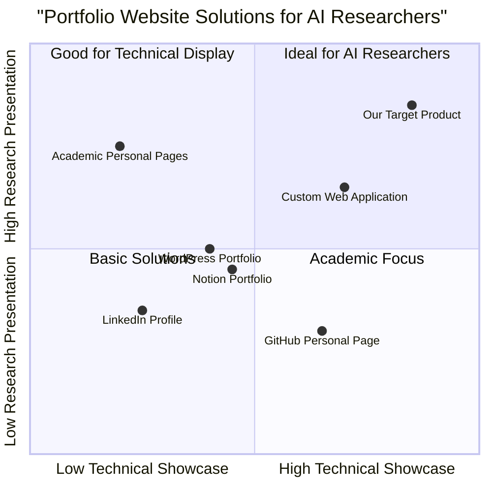

# Product Requirements Document: AI Researcher Portfolio Website

## Project Information

- **Project Name**: ai_researcher_portfolio
- **Programming Languages**: React, JavaScript, Tailwind CSS
- **Original Requirements**: Create an original portfolio website to boost a career as an engineering student in computer science, specifically in AI, with the goal to pursue research at Google.

## 1. Product Definition

### 1.1 Product Goals

1. Showcase the student's AI research expertise, technical skills, and academic achievements to stand out as a top candidate for Google's research positions.
2. Demonstrate practical implementation abilities through interactive AI project demonstrations and clean, accessible code samples.
3. Establish the student's unique research identity and thought leadership in specific AI domains to differentiate from other candidates.

### 1.2 User Stories

1. As a Google AI research recruiter, I want to quickly understand the candidate's AI specializations and research contributions so that I can assess their fit for our team.
2. As a technical hiring manager, I want to see actual code implementations and working demos so that I can evaluate the candidate's practical skills beyond theoretical knowledge.
3. As a potential research collaborator, I want to learn about the candidate's research interests and previous work so that I can identify potential collaboration opportunities.
4. As the portfolio owner, I want to easily update my projects, publications, and achievements so that my portfolio remains current and relevant.
5. As a non-technical HR representative, I want to understand the candidate's communication skills and research impacts so that I can evaluate their ability to explain complex topics.

### 1.3 Competitive Analysis

| Portfolio Solution | Pros | Cons |
|-------------------|------|------|
| GitHub Personal Page | - Free hosting - Direct integration with code repositories - Developer-friendly | - Limited design customization - Not optimized for showcasing research papers - Less impressive visual presentation |
| LinkedIn Profile | - Industry standard for professional networking - Built-in recommendation system - Wide reach | - Generic template - Limited technical demonstration capabilities - Restricted customization options |
| Academic Personal Pages | - Professional academic appearance - Focus on publications - Institutional credibility | - Often outdated designs - Limited interactivity - Few code demonstration options |
| WordPress Portfolio | - Extensive customization - Plugin ecosystem - Easy content management | - Potential performance issues - Security concerns - Not specialized for code display |
| Custom Web Application | - Complete creative control - Unique demonstration capabilities - Showcases technical ability through the site itself | - Development time investment - Maintenance requirements - Hosting costs |
| Notion Portfolio | - Easy to update - Modern aesthetic - Good organization | - Limited technical interactivity - Not ideal for code demonstrations - Template-driven |
| AI-Powered Portfolio (Our Target) | - Interactive AI demos - Specialized for research visualization - Customizable experience for visitors | - Development complexity - Requires regular updates - Balancing technical with accessible presentation |

### 1.4 Competitive Quadrant Chart

## 2. Technical Specifications

### 2.1 Requirements Analysis

The AI Researcher Portfolio Website must effectively present complex research work and technical projects in an accessible, interactive manner while maintaining a professional academic appearance. It needs to balance showcasing technical depth with clear communication suitable for both technical and non-technical audiences. The site must highlight the candidate's unique contributions to AI research and demonstrate their practical implementation skills.

The website will serve as both a comprehensive portfolio and a demonstration of technical abilities through its implementation. It must include interactive elements for exploring AI projects, clear organization of research publications, code samples with proper syntax highlighting, and responsive design for all devices. The site should incorporate elements that appeal specifically to Google's research teams by aligning with their values of innovation, technical excellence, and impact.

### 2.2 Requirements Pool

#### P0 (Must-have)

1. **Interactive Resume Section**
   - Must display education, skills, and relevant experience
   - Must include downloadable PDF version
   - Must highlight AI specializations and technical proficiencies

2. **Research Projects Showcase**
   - Must present at least 3-5 significant AI research projects
   - Must include problem statements, methodologies, and results for each project
   - Must incorporate visual elements (diagrams, charts) to explain complex concepts

3. **Publications Section**
   - Must list academic papers with proper citations
   - Must provide links to full texts or abstracts
   - Must highlight author contributions where applicable

4. **Code Repository Integration**
   - Must link to GitHub or similar platform
   - Must display code snippets with syntax highlighting
   - Must explain the significance of highlighted code samples

5. **Contact Information**
   - Must include professional email address
   - Must link to professional social profiles (LinkedIn, GitHub, Google Scholar)
   - Must provide a contact form for direct outreach

#### P1 (Should-have)

6. **Interactive AI Demos**
   - Should include at least one interactive demonstration of an AI project
   - Should allow visitors to experiment with parameters or inputs
   - Should visually display results of interactions

7. **Research Blog/Thoughts Section**
   - Should contain articulate posts about AI research topics
   - Should demonstrate thought leadership and communication skills
   - Should be regularly updated (monthly at minimum)

8. **Timeline of Research Journey**
   - Should visualize progression of skills and interests
   - Should highlight key milestones and pivots
   - Should indicate future research directions

9. **Testimonials/Recommendations**
   - Should include quotes from professors, collaborators, or mentors
   - Should emphasize research abilities and collaborative skills
   - Should add credibility to technical and research claims

10. **Dark/Light Mode Toggle**
    - Should offer both viewing options
    - Should save user preference
    - Should enhance readability in different environments

#### P2 (Nice-to-have)

11. **Publication Impact Metrics**
    - May include citation counts, h-index, or other impact metrics
    - May visualize research influence over time
    - May compare to field benchmarks

12. **Interactive Research Network**
    - May visualize connections between projects, papers, and collaborators
    - May allow exploration of research themes
    - May highlight interdisciplinary connections

13. **Automated Content Updates**
    - May pull recent publications from Google Scholar
    - May update GitHub project links automatically
    - May integrate with academic databases

14. **Multilingual Support**
    - May offer content in multiple languages
    - May auto-detect visitor's language preference
    - May prioritize languages relevant to research community

15. **Visitor Analytics Dashboard**
    - May track engagement with different sections
    - May provide insights on visitor backgrounds
    - May help refine content based on interest

### 2.3 UI Design Draft

#### Header
- Clean, minimalist navigation bar with sections: Home, Research, Publications, Projects, Blog, Contact
- Professional profile photo with name and current position/university
- Brief one-liner highlighting AI specialization
- Dark/light mode toggle

#### Home Page
- Hero section with animated visualization of an AI concept related to research focus
- Brief professional summary (3-4 sentences)
- Featured research highlight (most significant work)
- Key skills visualization (programming languages, AI frameworks, research methodologies)
- Call-to-action buttons: "View Research," "See Projects," "Download Resume"

#### Research Projects Section
- Card-based layout for each major project
- Each card includes: project title, thumbnail visualization, brief description
- Clicking expands to full project view with:
  - Problem statement
  - Methodology
  - Key findings/results
  - Interactive demo (where applicable)
  - Links to code/papers
  - Visual elements (charts, diagrams)

#### Publications Section
- Chronologically ordered list of academic publications
- Each entry includes: paper title, authors, conference/journal, year, abstract preview
- Filter options by: topic, year, publication type
- Citation metrics where available
- PDF download links

#### Code Projects Section
- GitHub integration showing repositories
- Code snippet highlights with syntax highlighting
- Project descriptions and technologies used
- Live demos where applicable

#### Blog/Research Thoughts
- Timeline-style presentation of articles
- Featured image for each post
- Reading time estimate
- Topic tags for filtering
- Comment/discussion capability

#### Contact Section
- Professional contact form
- Email and social media links
- Optional: calendar integration for scheduling research discussions

#### Footer
- Copyright information
- Quick navigation links
- Last updated timestamp
- Social media icons

### 2.4 Open Questions

1. **Content Management Strategy**: What is the most efficient way to update research content regularly? Should a headless CMS be integrated, or would a GitHub-based workflow be more appropriate for an AI researcher?

2. **Performance vs. Interactivity**: How can we balance the desire for interactive AI demonstrations with website performance? What level of complexity is appropriate for browser-based demos?

3. **Measurement of Success**: What metrics should be used to evaluate if the portfolio is effectively supporting the goal of securing a Google research position? Page visits, time spent, or specific engagement with projects?

4. **Privacy Considerations**: What research details should be publicly available versus gated for potential employers only, especially for ongoing or unpublished work?

5. **Maintenance Requirements**: How much ongoing maintenance will be required to keep the portfolio current and technically functional, and what tools can minimize this burden?

## 3. Implementation Roadmap

### Phase 1: Foundation (Weeks 1-2)
- Set up React project with Tailwind CSS
- Implement responsive layout and navigation
- Create basic page structure and routing
- Design and implement dark/light mode

### Phase 2: Core Content (Weeks 3-4)
- Develop Resume/About section
- Implement Publications listing
- Create Project showcase structure
- Set up contact form and links

### Phase 3: Interactive Elements (Weeks 5-6)
- Implement code snippet highlighting
- Develop blog/research thoughts section
- Create interactive project demonstrations
- Integrate GitHub repository displays

### Phase 4: Polish & Optimization (Weeks 7-8)
- Performance optimization
- SEO implementation
- Cross-browser testing
- Accessibility compliance
- Content refinement

## 4. Success Metrics

### 4.1 Technical Metrics
- Page load time < 2 seconds
- Mobile responsiveness across all devices
- Accessibility score > 95%
- SEO optimization score > 90%

### 4.2 User Engagement Metrics
- Average session duration > 3 minutes
- Project section engagement > 60%
- Publication click-through rate > 40%
- Interactive demo participation > 25%

### 4.3 Career Advancement Metrics
- Inquiries from research teams/recruiters
- Invitation rate for interviews
- Positive feedback from industry professionals
- Citations or mentions of portfolio projects

## 5. Conclusion

This AI Researcher Portfolio Website will serve as a powerful tool for showcasing research expertise and technical skills specifically tailored toward securing AI research positions at Google. By emphasizing interactive demonstrations, thoughtful presentation of research, and clean code samples, the portfolio will distinguish the candidate from others in this competitive field.

The implementation will balance academic professionalism with technical innovation, providing clear evidence of the candidate's capabilities as both a researcher and a practical implementer. Through careful attention to the needs of the target audience (research recruiters and technical hiring managers), the portfolio will effectively communicate not just what the candidate knows, but how they think and approach complex AI challenges.