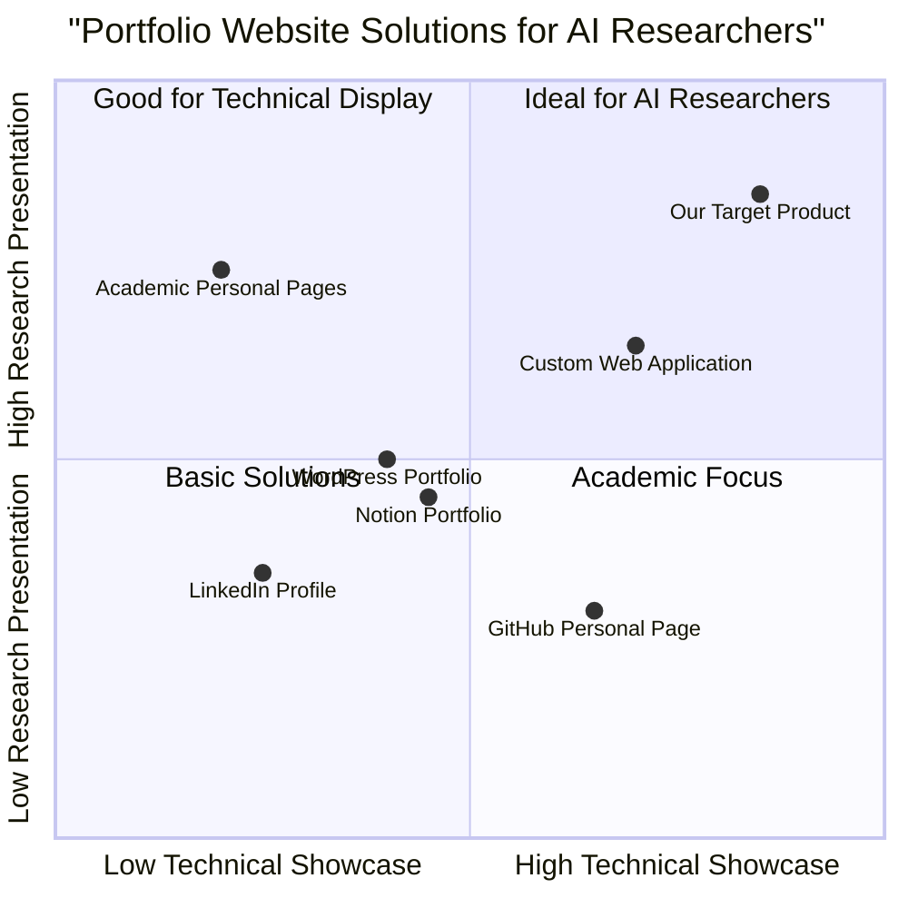

# Product Requirements Document: AI Researcher Portfolio Website

## Project Information

- **Project Name**: ai_researcher_portfolio
- **Programming Languages**: React, JavaScript, Tailwind CSS
- **Original Requirements**: Create an original portfolio website to boost a career as an engineering student in computer science, specifically in AI, with the goal to pursue research at Google.

## 1. Product Definition

### 1.1 Product Goals

1. Showcase the student's AI research expertise, technical skills, and academic achievements to stand out as a top candidate for Google's research positions.
2. Demonstrate practical implementation abilities through interactive AI project demonstrations (particularly VidAI and EcoSort) and clean, accessible code samples.
3. Establish the student's unique research identity in XAI (eXplainable AI) and computer vision, highlighting published works and the engineer-doctorate path.

### 1.2 User Stories

1. As a Google AI research recruiter, I want to quickly understand the candidate's AI specializations (computer vision, XAI, transformers) and research contributions so that I can assess their fit for our team.
2. As a technical hiring manager, I want to see actual code implementations and working demos of projects like VidAI and EcoSort so that I can evaluate the candidate's practical skills beyond theoretical knowledge.
3. As a potential research collaborator, I want to learn about the candidate's research interests and previous publications (like the RJCIA paper on ViT architectures) so that I can identify potential collaboration opportunities.
4. As the portfolio owner, I want to easily update my projects, publications, and achievements in both French and English so that my portfolio remains current and relevant.
5. As a non-technical HR representative, I want to understand the candidate's communication skills (through blog posts like "YOLOv8 Explained") and research impacts so that I can evaluate their ability to explain complex topics.

### 1.3 Competitive Analysis

| Portfolio Solution | Pros | Cons |
|-------------------|------|------|
| GitHub Personal Page | - Free hosting - Direct integration with code repositories - Developer-friendly | - Limited design customization - Not optimized for showcasing XAI research papers - Less impressive visual presentation |
| LinkedIn Profile | - Industry standard for professional networking - Built-in recommendation system - Wide reach | - Generic template - Limited technical demonstration capabilities - Restricted customization for AI project demos |
| Academic Personal Pages | - Professional academic appearance - Focus on publications like RJCIA paper - Institutional credibility | - Often outdated designs - Limited interactivity - Few code demonstration options |
| WordPress Portfolio | - Extensive customization - Plugin ecosystem - Easy content management | - Potential performance issues - Security concerns - Not specialized for AI model visualization |
| Custom Web Application | - Complete creative control - Unique demonstration capabilities for projects like VidAI - Showcases technical ability through the site itself | - Development time investment - Maintenance requirements - Hosting costs |
| Notion Portfolio | - Easy to update - Modern aesthetic - Good organization | - Limited technical interactivity - Not ideal for AI model demonstrations - Template-driven |
| Multilingual AI Portfolio (Our Target) | - Interactive AI demos of VidAI and EcoSort - Specialized for XAI visualization - Supports French/English content | - Development complexity - Requires regular updates - Balancing technical with accessible presentation |

### 1.4 Competitive Quadrant Chart

## 2. Technical Specifications

### 2.1 Requirements Analysis

The AI Researcher Portfolio Website must effectively present complex research work in eXplainable AI and computer vision along with technical projects like VidAI and EcoSort in an accessible, interactive manner. It needs to balance showcasing technical depth in PyTorch, TensorFlow, and computer vision with clear communication suitable for both technical and non-technical audiences. The site must highlight the candidate's unique contributions to AI research (including the RJCIA 2024 publication) and demonstrate practical implementation skills.

The website will serve as both a comprehensive portfolio and a demonstration of technical abilities through its implementation. It must include interactive elements for exploring AI projects (particularly VidAI and EcoSort), clear organization of research publications, code samples with proper syntax highlighting for Python, R, and SQL, and responsive design for all devices. The site should incorporate elements that appeal specifically to Google's research teams by aligning with their values of innovation, technical excellence, and impact in AI explainability and computer vision.

Multilingual support is essential, as the candidate is a native French speaker with English as a second language, and the portfolio should effectively communicate in both languages to reach a wider audience while showcasing language skills.

### 2.2 Requirements Pool

#### P0 (Must-have)

1. **Bilingual Resume Section (French/English)**
   - Must display education (ENSEIRB-MATMECA, EPSI, engineer-doctorate path)
   - Must include downloadable PDF version of CV in both languages
   - Must highlight AI specializations (computer vision, XAI) and technical proficiencies (PyTorch, TensorFlow, etc.)

2. **Research Projects Showcase**
   - Must present VidAI and EcoSort projects with detailed descriptions
   - Must include RJCIA 2024 paper on ViT architectures using LIME, SHAP, and Grad-CAM
   - Must incorporate visual elements to explain XAI methods and results

3. **Publications Section**
   - Must list academic paper (RJCIA 2024) with proper citation
   - Must showcase technical blog post (YOLOv8 Explained)
   - Must provide links to full texts or abstracts

4. **Code Repository Integration**
   - Must link to GitHub repositories of projects
   - Must display Python code snippets with syntax highlighting
   - Must explain the significance of AI model implementations

5. **Contact Information**
   - Must include professional email address
   - Must link to professional profiles (LinkedIn, GitHub)
   - Must provide a contact form for direct outreach

#### P1 (Should-have)

6. **Interactive AI Demos**
   - Should include interactive demonstration of VidAI project
   - Should showcase EcoSort image recognition functionality
   - Should allow visitors to experiment with model parameters

7. **Research Blog/Thoughts Section**
   - Should expand on "YOLOv8 Explained" blog concept
   - Should include posts about XAI and computer vision topics
   - Should demonstrate thought leadership in multiple languages

8. **Timeline of Research Journey**
   - Should visualize progression from BTS to engineer-doctorate path
   - Should highlight key milestones (competition win with EcoSort)
   - Should indicate future research directions in XAI

9. **Testimonials/Recommendations**
   - Should include quotes from internship supervisors at Cali Intelligences
   - Should emphasize research abilities and collaborative skills
   - Should add credibility to technical and research claims

10. **Language Selector**
    - Should toggle between French and English versions
    - Should maintain consistent design across language versions
    - Should enhance international research accessibility

#### P2 (Nice-to-have)

11. **XAI Visualization Tools**
    - May include interactive demonstrations of LIME, SHAP, and Grad-CAM
    - May show explainability methods applied to example images
    - May allow visitors to compare different XAI techniques

12. **Research Network Visualization**
    - May visualize connections between AI projects, papers, and technologies
    - May show relationships between different explainability methods
    - May highlight interdisciplinary connections

13. **Automated Content Updates**
    - May pull recent GitHub activity
    - May integrate with Medium for blog posts
    - May update publication metrics automatically

14. **Extended Language Support**
    - May add Spanish and Chinese content based on language skills
    - May auto-detect visitor's language preference
    - May showcase language versatility

15. **MLOps Portfolio Section**
    - May demonstrate experience with Docker, Kubeflow, and Kubernetes
    - May showcase understanding of IA Act and GDPR compliance
    - May highlight professional experience with MLOps at Cali Intelligences

### 2.3 UI Design Draft

#### Header
- Clean, minimalist navigation bar with sections: Home, Research, Publications, Projects, Blog, Contact
- Professional profile photo with name and current position (ENSEIRB-MATMECA engineering student)
- Brief one-liner highlighting XAI and computer vision specialization
- Language selector (FR/EN) and dark/light mode toggle

#### Home Page
- Hero section with animated visualization of an XAI concept (e.g., Grad-CAM heatmap)
- Brief professional summary (3-4 sentences highlighting engineer-doctorate path)
- Featured research highlight (RJCIA 2024 paper)
- Key skills visualization (Python, PyTorch, TensorFlow, OpenCV, etc.)
- Call-to-action buttons: "View Research," "See Projects," "Download Resume"

#### Research Projects Section
- Card-based layout for each major project
- Featured cards for VidAI and EcoSort
- Each card includes: project title, thumbnail visualization, brief description
- Clicking expands to full project view with:
  - Problem statement
  - Methodology (including AI Act and GDPR compliance where applicable)
  - Key findings/results
  - Interactive demo (particularly for VidAI)
  - Links to code/papers
  - Visual elements (charts, diagrams)

#### Publications Section
- Chronologically ordered list of academic and technical publications
- Highlighted entry for RJCIA 2024 paper on ViT architectures
- YOLOv8 Explained Medium article with preview
- PDF download links where available

#### Code Projects Section
- GitHub integration showing repositories
- Code snippet highlights with syntax highlighting for Python
- Project descriptions emphasizing XAI and computer vision techniques
- Live demos where applicable (especially VidAI)

#### Blog/Research Thoughts
- Timeline-style presentation of articles in both French and English
- Featured image for each post
- Reading time estimate
- Topic tags for filtering (XAI, Computer Vision, MLOps, etc.)

#### Experience Section
- Timeline view of professional experience
- Detailed card for Cali Intelligences experience
- Skills acquired and projects completed during each position
- Testimonials from supervisors where available

#### Contact Section
- Professional contact form
- Email and social media links
- Optional: calendar integration for scheduling research discussions

#### Footer
- Copyright information
- Quick navigation links
- Last updated timestamp
- Social media icons
- Language toggle reminder

### 2.4 Open Questions

1. **Multilingual Content Management**: What is the most efficient way to manage and synchronize content in both French and English? Should the site use automatic translation with manual correction, or entirely separate content management?

2. **XAI Demonstration Complexity**: How can we effectively demonstrate complex XAI methods like LIME, SHAP, and Grad-CAM in an accessible, browser-friendly way without sacrificing technical accuracy?

3. **Project Demo Integration**: For the VidAI project, what level of functionality should be directly incorporated into the portfolio versus linked externally? How can we balance showcasing capabilities without duplicating the entire project?

4. **Professional vs. Academic Balance**: How should the portfolio balance presenting academic research credentials (for the engineer-doctorate path) with professional experience and practical implementations?

5. **Privacy Considerations**: What level of detail should be publicly shared about the work at Cali Intelligences, particularly regarding AI systems for detecting suspicious behaviors?

## 3. Implementation Roadmap

### Phase 1: Foundation (Weeks 1-2)
- Set up React project with Tailwind CSS
- Implement responsive layout and navigation
- Create basic page structure and routing
- Design and implement language selector and dark/light mode
- Import profile information and basic resume data

### Phase 2: Core Content (Weeks 3-4)
- Develop bilingual Resume/About section
- Implement Publications listing (RJCIA 2024 paper, YOLOv8 blog)
- Create Project showcase structure (VidAI, EcoSort)
- Set up contact form and links
- Import education history (ENSEIRB-MATMECA, EPSI)

### Phase 3: Interactive Elements (Weeks 5-6)
- Implement code snippet highlighting for Python examples
- Develop blog/research thoughts section
- Create interactive demonstration for VidAI
- Integrate GitHub repository displays
- Implement XAI visualization components

### Phase 4: Polish & Optimization (Weeks 7-8)
- Performance optimization
- SEO implementation in both languages
- Cross-browser testing
- Accessibility compliance
- Content refinement and translation verification

## 4. Success Metrics

### 4.1 Technical Metrics
- Page load time < 2 seconds
- Mobile responsiveness across all devices
- Accessibility score > 95%
- SEO optimization score > 90% in both languages

### 4.2 User Engagement Metrics
- Average session duration > 3 minutes
- VidAI and EcoSort project engagement > 60%
- RJCIA 2024 publication click-through rate > 40%
- Interactive demo participation > 25%

### 4.3 Career Advancement Metrics
- Inquiries from Google AI research teams
- Invitation rate for interviews related to engineer-doctorate programs
- Positive feedback from AI industry professionals
- Citations or mentions of portfolio projects and publications

## 5. Conclusion

This AI Researcher Portfolio Website will serve as a powerful tool for showcasing research expertise in XAI and computer vision, along with technical skills specifically tailored toward securing AI research positions at Google. By emphasizing the unique combination of engineering education at ENSEIRB-MATMECA and hands-on AI development experience, the portfolio will distinguish the candidate in this competitive field.

The implementation will balance academic rigor with practical application, providing clear evidence of the candidate's capabilities in both research (RJCIA 2024 paper) and implementation (VidAI, EcoSort). Through careful attention to multilingual presentation and interactive demonstrations of XAI techniques, the portfolio will effectively communicate not just technical knowledge, but also thought leadership and innovation potential that aligns with Google's research values.