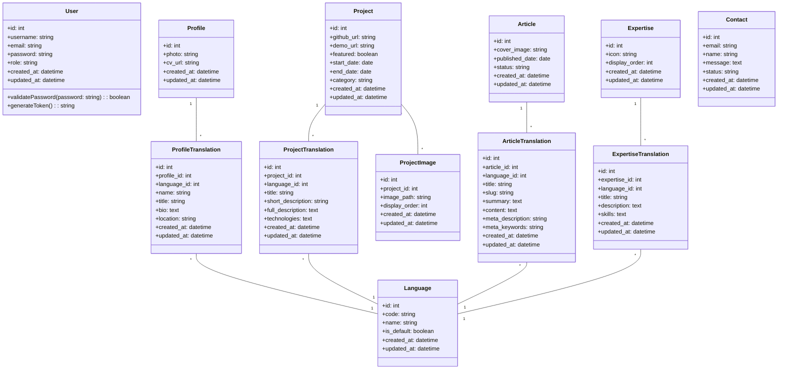
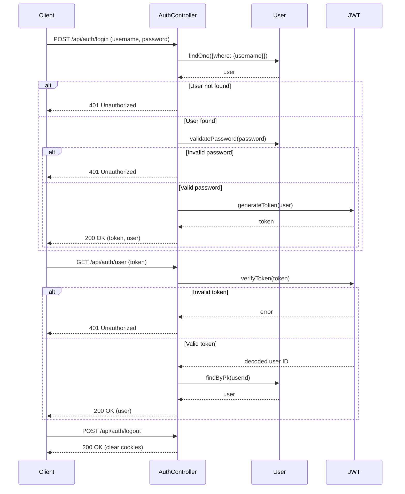
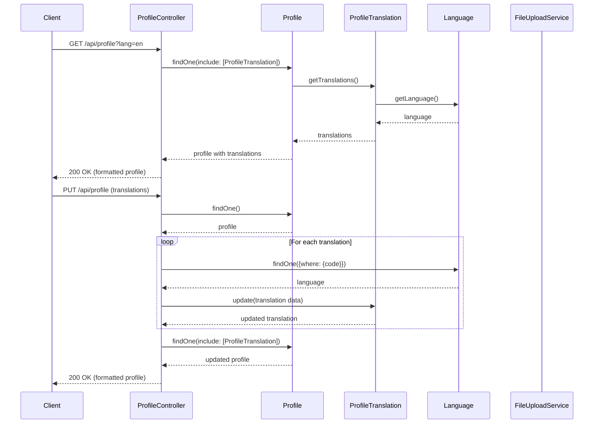
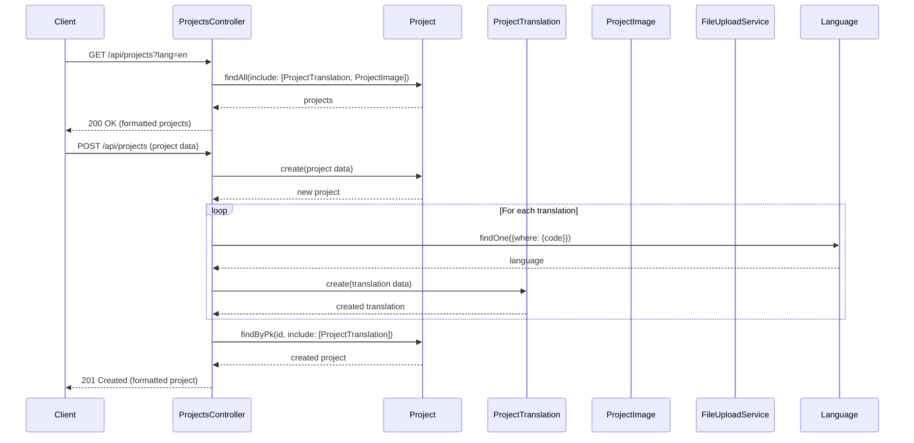
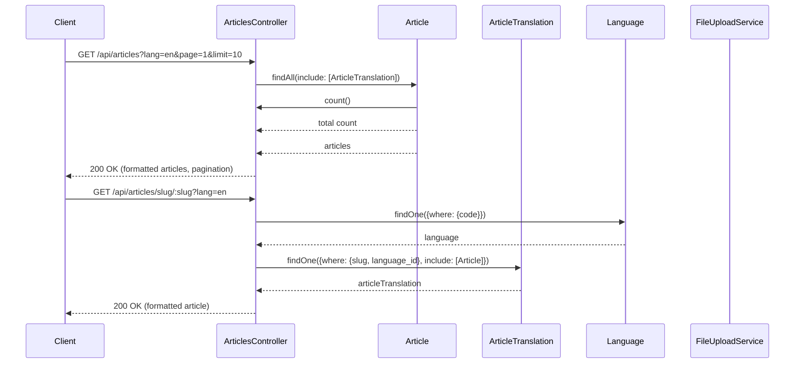
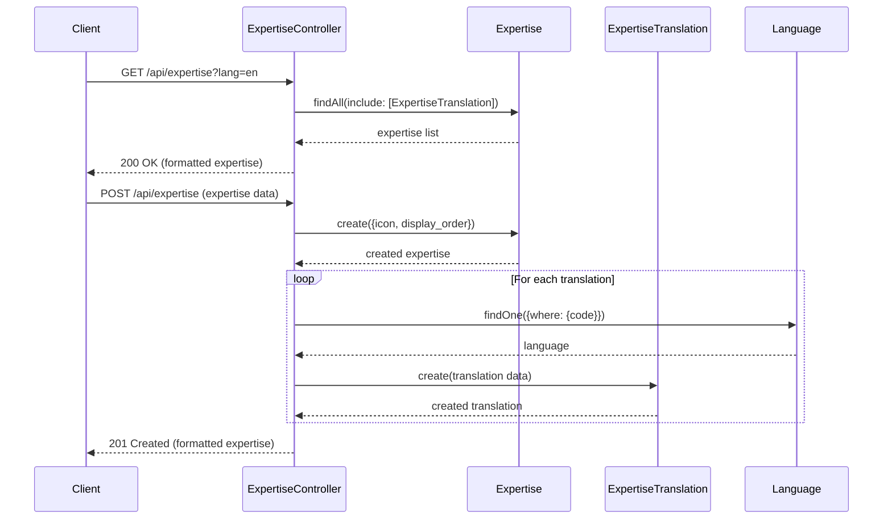

# AI Researcher Portfolio System Design

## Implementation approach

For the AI Researcher Portfolio system, we'll implement a complete web application with a clear separation between frontend and backend. The system will support multilingual content management, project showcasing, blog functionality, and an admin interface for content management.

### Key Technologies

#### Frontend
- **React**: For building a responsive, component-based UI
- **Tailwind CSS**: For efficient styling with utility classes
- **React Router**: For client-side routing
- **i18next**: For internationalization support
- **Axios**: For API communication

#### Backend
- **Node.js & Express**: Server-side JavaScript runtime and framework
- **MySQL**: Relational database with robust transaction support
- **Sequelize ORM**: For database interactions and model management
- **JSON Web Tokens (JWT)**: For secure authentication
- **Express-fileupload**: For handling document and image uploads
- **bcrypt**: For secure password hashing

### Architecture Overview

The system follows a standard three-tier architecture:
1. **Presentation Layer**: React-based frontend with responsive design
2. **Application Layer**: Express API for business logic and data processing
3. **Data Layer**: MySQL database with Sequelize ORM

### Key Features

- **Multilingual Support**: Full content translation support with language switching
- **Project Portfolio**: Showcase research projects with images and descriptions
- **Blog/Articles**: Academic article publishing with SEO optimization
- **Expertise Showcase**: Display research specialties and skills
- **Contact Form**: Direct communication channel with visitors
- **Admin Dashboard**: Secure interface for content management
- **Responsive Design**: Mobile-first approach for all device compatibility

## Data structures and interfaces



### Key API Interfaces

#### Authentication Service
```typescript
interface AuthService {
  login(username: string, password: string): Promise<{token: string, user: User}>
  logout(): void
  getCurrentUser(): Promise<User>
  changePassword(oldPassword: string, newPassword: string): Promise<boolean>
  register(username: string, email: string, password: string, role: string): Promise<User>
}
```

#### Profile Service
```typescript
interface ProfileService {
  getProfile(lang?: string): Promise<Profile>
  updateProfile(profileData: Partial<Profile>, translations: Record<string, ProfileTranslation>): Promise<Profile>
  uploadPhoto(file: File): Promise<string>
  uploadCV(file: File): Promise<string>
}
```

#### Projects Service
```typescript
interface ProjectsService {
  getAllProjects(lang?: string, options?: {featured?: boolean, category?: string}): Promise<Project[]>
  getProjectById(id: number, lang?: string): Promise<Project>
  createProject(projectData: Partial<Project>, translations: Record<string, ProjectTranslation>): Promise<Project>
  updateProject(id: number, projectData: Partial<Project>, translations: Record<string, ProjectTranslation>): Promise<Project>
  deleteProject(id: number): Promise<boolean>
  uploadImage(projectId: number, file: File): Promise<ProjectImage>
  deleteImage(projectId: number, imageId: number): Promise<boolean>
  updateImagesOrder(projectId: number, imageOrder: {id: number, display_order: number}[]): Promise<ProjectImage[]>
}
```

#### Articles Service
```typescript
interface ArticlesService {
  getAllArticles(lang?: string, page?: number, limit?: number): Promise<{articles: Article[], pagination: PaginationInfo}>
  getArticleById(id: number, lang?: string): Promise<Article>
  getArticleBySlug(slug: string, lang: string): Promise<Article>
  createArticle(articleData: Partial<Article>, translations: Record<string, ArticleTranslation>, coverImage?: File): Promise<Article>
  updateArticle(id: number, articleData: Partial<Article>, translations: Record<string, ArticleTranslation>, coverImage?: File): Promise<Article>
  deleteArticle(id: number): Promise<boolean>
}
```

#### Expertise Service
```typescript
interface ExpertiseService {
  getAllExpertise(lang?: string): Promise<Expertise[]>
  getExpertiseById(id: number, lang?: string): Promise<Expertise>
  createExpertise(expertiseData: Partial<Expertise>, translations: Record<string, ExpertiseTranslation>): Promise<Expertise>
  updateExpertise(id: number, expertiseData: Partial<Expertise>, translations: Record<string, ExpertiseTranslation>): Promise<Expertise>
  deleteExpertise(id: number): Promise<boolean>
  updateExpertiseOrder(orderData: {id: number, display_order: number}[]): Promise<Expertise[]>
}
```

#### Languages Service
```typescript
interface LanguagesService {
  getAllLanguages(): Promise<Language[]>
  getLanguageById(id: number): Promise<Language>
  createLanguage(code: string, name: string, isDefault?: boolean): Promise<Language>
  updateLanguage(id: number, data: Partial<Language>): Promise<Language>
  deleteLanguage(id: number): Promise<boolean>
  setDefaultLanguage(id: number): Promise<Language>
}
```

#### Contact Service
```typescript
interface ContactService {
  submitContactForm(name: string, email: string, message: string): Promise<Contact>
  getAllMessages(): Promise<Contact[]>
  updateMessageStatus(id: number, status: string): Promise<Contact>
  deleteMessage(id: number): Promise<boolean>
}
```

## Program call flow

### User Authentication Flow



### Profile Management Flow



### Project Management Flow



### Articles Management Flow



### Expertise Management Flow



## Anything UNCLEAR

There are a few areas where additional clarification might be needed:

1. **Long-term content archival requirements**: Should old articles/projects be archived rather than deleted?

2. **Performance considerations**: If the portfolio grows large, we might need pagination for all list endpoints and database query optimization.

3. **Analytics integration**: The system doesn't currently have analytics tracking, which might be beneficial for understanding visitor engagement.

4. **Backup strategy**: A clear backup strategy should be defined for both database and uploaded files.

5. **SEO requirements**: Beyond meta tags, any specific SEO requirements (like sitemap generation or structured data) should be clarified.