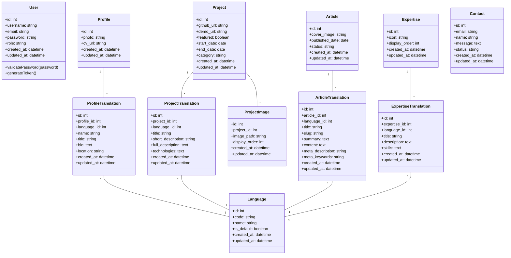

# Portfolio Backend System Design

## Implementation approach

We will implement a bilingual AI researcher portfolio backend system using Node.js, Express, and MySQL. This system will support multiple languages, content management, and secure authentication for the administrator.

### Key Technologies

- **Node.js & Express**: Server-side runtime and framework for building the API
- **MySQL**: Relational database for storing structured portfolio data
- **Sequelize ORM**: Object-Relational Mapping for database interaction
- **JSON Web Tokens (JWT)**: For secure authentication and session management
- **Express-fileupload**: For handling file uploads (images, CV, etc.)
- **Bcrypt**: For password hashing and security
- **CORS**: For secure cross-origin requests from frontend

### Challenging Points & Solutions

1. **Multilingual Content Management**
   - Solution: Implement a translation table structure with language-specific content linked to main entities
   - Language codes will be used as identifiers for efficient content switching

2. **Secure File Management**
   - Solution: Implement a dedicated file upload service with security checks and standardized storage paths
   - Support for different file types (images, documents) with appropriate validation

3. **Authentication & Security**
   - Solution: Implement JWT-based authentication with refresh tokens stored in HTTP-only cookies
   - Role-based access control for administration functions

## Data structures and interfaces

### Core Models

```javascript
// Database configuration
const sequelize = new Sequelize({
  dialect: 'mysql',
  host: process.env.DB_HOST,
  username: process.env.DB_USER,
  password: process.env.DB_PASSWORD,
  database: process.env.DB_NAME,
  logging: false
});
```

### Entity Relationships



## API Endpoints

### Authentication

- `POST /api/auth/login` - User login
- `POST /api/auth/logout` - User logout
- `GET /api/auth/user` - Get current user
- `POST /api/auth/change-password` - Change password
- `POST /api/auth/register` - Register new user (admin only)

### Profile Management

- `GET /api/profile` - Get profile information
- `PUT /api/profile` - Update profile information
- `POST /api/profile/photo` - Upload profile photo
- `POST /api/profile/cv` - Upload CV

### Projects Management

- `GET /api/projects` - Get all projects
- `GET /api/projects/:id` - Get project by ID
- `POST /api/projects` - Create new project
- `PUT /api/projects/:id` - Update project
- `DELETE /api/projects/:id` - Delete project
- `POST /api/projects/:id/images` - Upload project image
- `DELETE /api/projects/:id/images/:imageId` - Delete project image
- `PUT /api/projects/:id/images/order` - Update project image order

### Articles Management

- `GET /api/articles` - Get all articles (with pagination)
- `GET /api/articles/:id` - Get article by ID
- `GET /api/articles/slug/:slug` - Get article by slug
- `POST /api/articles` - Create new article
- `PUT /api/articles/:id` - Update article
- `DELETE /api/articles/:id` - Delete article

### Expertise Management

- `GET /api/expertise` - Get all expertise
- `GET /api/expertise/:id` - Get expertise by ID
- `POST /api/expertise` - Create new expertise
- `PUT /api/expertise/:id` - Update expertise
- `DELETE /api/expertise/:id` - Delete expertise
- `PUT /api/expertise/order` - Update expertise display order

### Languages Management

- `GET /api/languages` - Get all languages
- `GET /api/languages/:id` - Get language by ID
- `POST /api/languages` - Create new language
- `PUT /api/languages/:id` - Update language
- `DELETE /api/languages/:id` - Delete language
- `PUT /api/languages/:id/set-default` - Set default language

### Contact Management

- `POST /api/contact` - Create contact message
- `GET /api/contact` - Get all contact messages (admin only)
- `PUT /api/contact/:id` - Update contact message status (admin only)
- `DELETE /api/contact/:id` - Delete contact message (admin only)

## Program call flow

### Authentication Flow


### Profile Management Flow


### Project Management Flow


### Article Management Flow


### Language Management Flow


### Expertise Management Flow


## Security Considerations

1. **Authentication**
   - JWT tokens with appropriate expiration
   - HTTP-only cookies for refresh tokens
   - Password hashing with bcrypt

2. **Input Validation**
   - Validation of all user inputs
   - Sanitization of data before database operations

3. **File Uploads**
   - File type verification
   - Size limitations
   - Secure storage paths

4. **CORS Configuration**
   - Proper CORS settings to restrict unauthorized origins

5. **Error Handling**
   - Consistent error responses
   - Logging without exposing sensitive information

## Deployment Considerations

1. **Environment Variables**
   - Database credentials
   - JWT secret
   - CORS origins
   - Upload paths

2. **Database Migrations**
   - Initial schema creation
   - Seed data for initial setup

3. **File Storage**
   - Properly configured file permissions
   - Regular backups of uploaded files

## Anything UNCLEAR

1. **Backup Strategy**: The system should include a backup strategy for both database and uploaded files, but specific requirements for backup frequency and retention are not defined.

2. **Rate Limiting**: Implementation of rate limiting for API endpoints to prevent abuse is recommended but not explicitly defined in requirements.

3. **Analytics**: If usage analytics are required for the admin dashboard, we would need to implement appropriate tracking mechanisms.

4. **Multi-admin Support**: The current design allows for multiple admin users, but the requirements don't specify if there should be different admin roles or permissions.

5. **SEO Optimization**: While meta tags are included for articles, additional SEO features may be needed depending on specific requirements.